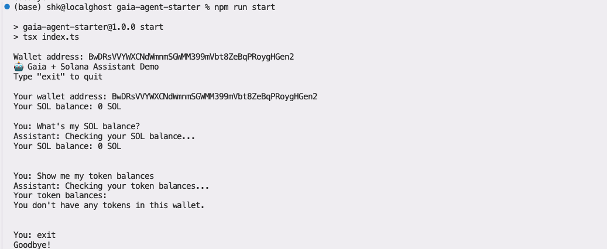

# Gaia + Solana Integration Example

This example demonstrates how to use Gaia's OpenAI Compatible Nodes with Solana blockchain functionality, inspired by Solana AgentKit.



## Features

- Integrates Gaia's OpenAI-compatible API with Solana blockchain operations
- Provides a simple chat interface for interacting with the agent
- Supports key Solana operations:
  - Checking SOL balance
  - Viewing token balances
  - Transferring SOL
- Uses function calling to execute blockchain operations
- Maintains conversation history for context awareness

## Prerequisites

- Node.js (v16 or higher recommended)
- npm, yarn, or pnpm
- A Solana wallet with private key
- Solana RPC URL (e.g., from QuickNode, Alchemy, or Helius)
- Gaia API credentials (API key, Node URL, and model name)

## Installation

1. Clone the repository:
```bash
git clone https://github.com/sendaifun/solana-agent-kit.git
cd solana-agent-kit/examples/misc/gaia-agent-starter
```

2. Install dependencies:
```bash
npm install
```

3. Create a `.env` file based on `.env.example` and fill in your credentials:
```bash
cp .env.example .env
```

Edit the `.env` file with your actual credentials:
```
# Gaia Configuration
GAIA_NODE_URL=https://your-gaia-node-url/v1
GAIA_API_KEY=your-gaia-api-key
GAIA_MODEL_NAME=your-preferred-model-name

# Solana Configuration
RPC_URL=https://api.devnet.solana.com
SOLANA_PRIVATE_KEY=your-solana-private-key-in-base58
```

## Usage

Start the application:

```bash
npm start
```

This will launch an interactive chat interface where you can:
- Type `exit` to quit the application
- Ask the agent questions about your Solana wallet
- Request the agent to perform Solana operations

Example prompts:
- "What's my SOL balance?"
- "Show me my token balances"
- "Send 0.01 SOL to <wallet address>"

## How It Works

The example uses:

1. **OpenAI Node.js SDK**: Connects to Gaia's OpenAI-compatible API
2. **@solana/web3.js**: Provides direct interaction with the Solana blockchain
3. **Function Calling**: Allows the AI to execute Solana operations

The key integration points are:

1. **OpenAI Client Configuration**:
```typescript
const openai = new OpenAI({
  apiKey: process.env.GAIA_API_KEY,
  baseURL: process.env.GAIA_NODE_URL,
});
```

2. **Function Definitions**:
```typescript
const functions = [
  {
    name: "getSOLBalance",
    description: "Get the SOL balance of a wallet",
    parameters: {
      // ...
    }
  },
  // ...
];
```

3. **Function Execution**:
```typescript
if (message.function_call) {
  const functionName = message.function_call.name;
  const functionArgs = JSON.parse(message.function_call.arguments);
  
  // Execute the function and get the result
  // ...
  
  // Add the result to the conversation history
  history.push({
    role: "function",
    name: functionName,
    content: JSON.stringify(functionResult)
  });
}
```

## Troubleshooting

If you encounter issues:

1. **API Connection Errors**:
   - Verify your `GAIA_NODE_URL` is correct and includes the `/v1` path
   - Check that your `GAIA_API_KEY` is valid

2. **Model not found errors**:
   - Make sure the `GAIA_MODEL_NAME` you specified is available in your Gaia subscription

3. **Function calling not supported**:
   - Ensure your Gaia model supports function calling
   - If function calling isn't supported, modify the code to use a simpler approach

4. **Solana connection issues**:
   - Ensure your `RPC_URL` is valid and responsive
   - Check that your wallet has SOL (especially if on devnet/testnet)
   - Verify your private key is correctly formatted in base58

## Customization

You can customize this example by:

1. Adding more Solana functions (NFT operations, DeFi interactions, etc.)
2. Modifying the system prompt to specialize the assistant
3. Adding more sophisticated error handling
4. Implementing a web interface instead of a terminal-based one

## Contributing

Contributions are welcome! Please feel free to submit a Pull Request.